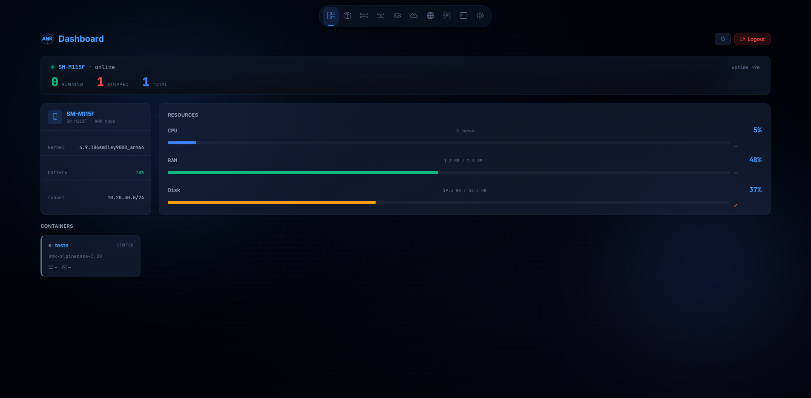
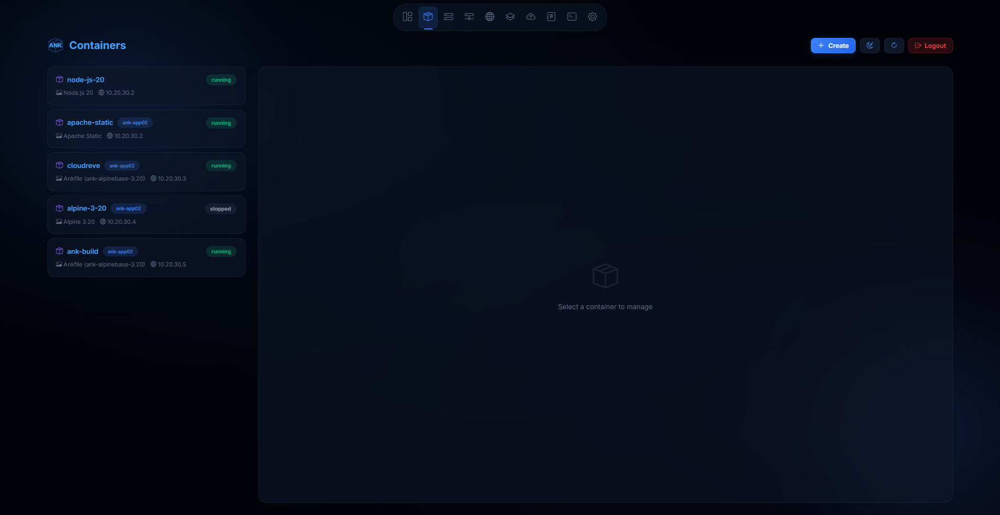
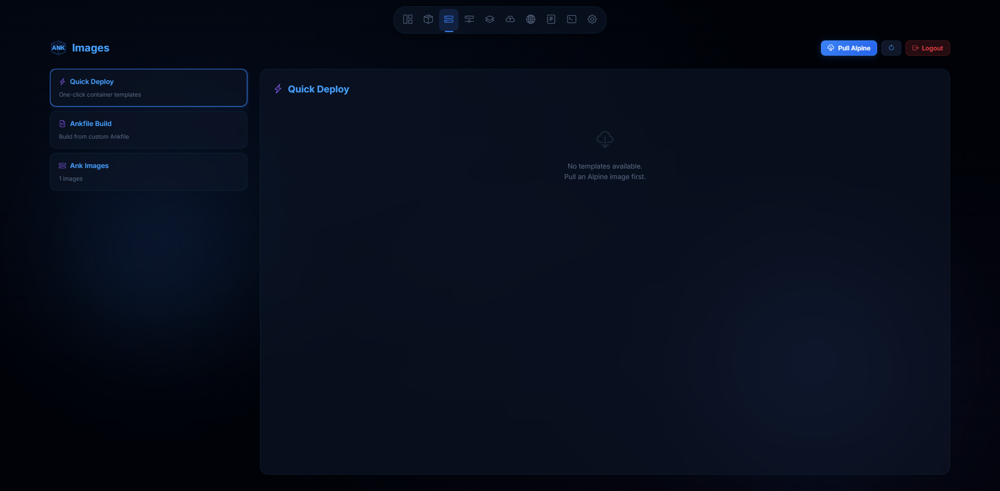
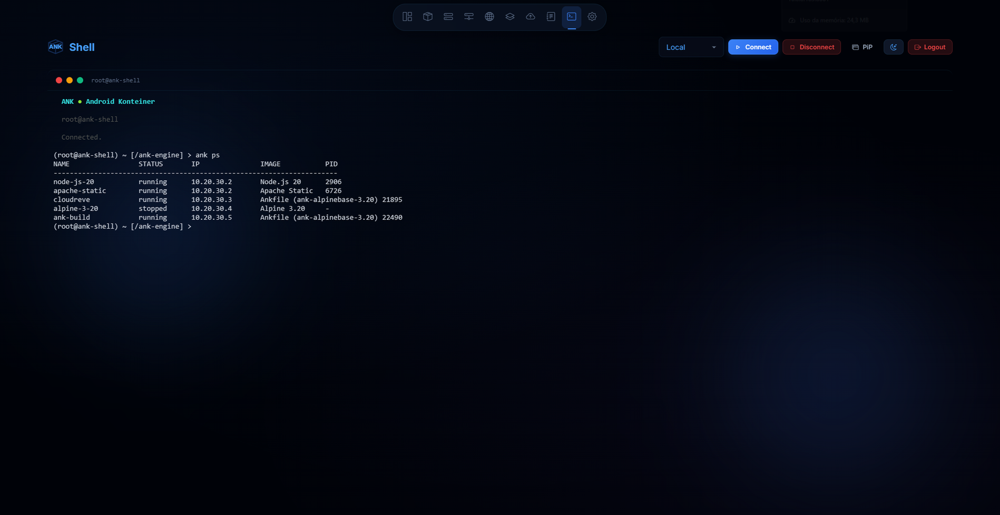
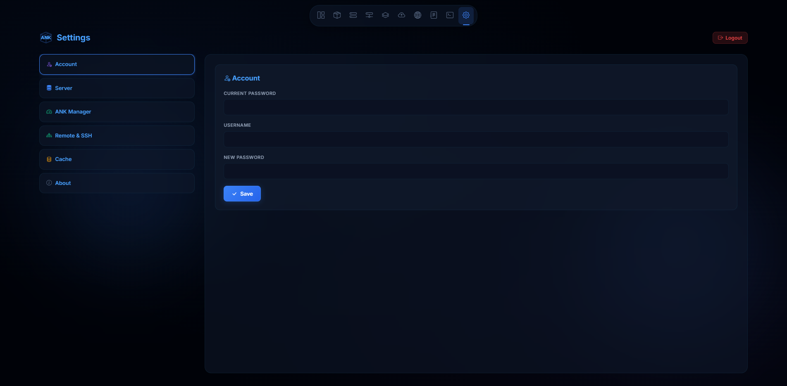
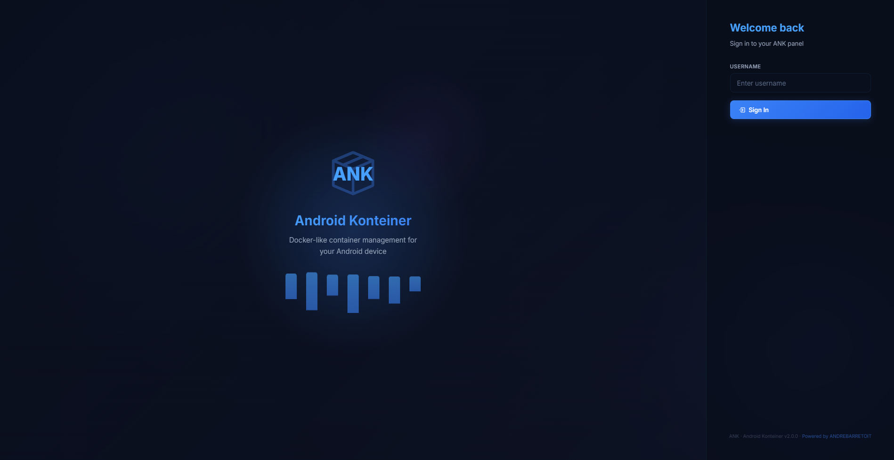

<div align="center">

# ANK

**Android Konteiner**

Docker-like container platform for Android — runs Linux containers via chroot (Magisk root) with a full web UI, REST API, and CLI.

[](https://www.gnu.org/software/bash/)
[](https://www.python.org/)
[](https://www.magiskapp.com/)
[](LICENSE)
[](https://github.com/andrebarretoit/ank)
[](https://www.android.com/)

<br>

[andrebarreto.work](https://andrebarreto.work) · [GitHub](https://github.com/andrebarretoit) · [LinkedIn](https://linkedin.com/in/andrebarretoit)

</div>

---

> **Project status — Testing phase**
>
> ANK is under active development and is **not production-ready**. The engine, web panel, REST API and CLI already work and can be tested end to end, but bugs are expected — use a test device.
>
> | Component | State in this build |
> |---|---|
> | ANK engine (root — Magisk + chroot) | Functional for testing |
> | Web panel · REST API · `ank` CLI | Functional for testing |
> | **Lite / PRoot (no root)** | **Demo only** — the ANK engine for non-rooted devices is not 100% developed yet. It installs and runs so you can look around, and it will become fully functional in a future update |
> | **Stacks** | Partially implemented, **disabled** — the Stacks page shows "Coming soon" |
> | **Backups** | Partially implemented, **disabled** — the Backups page shows "Coming soon" |
> | Multi-device nodes | Functional for testing |

---

## What is ANK?

**ANK** (**A**ndroid **K**onteiner) is a container engine for Android that runs Linux containers via Magisk root + chroot. It also installs on non-rooted devices through PRoot, but read the status table above: that path is currently a **demo**. No compilation needed — everything is shell scripts and a Python HTTP server with a Portainer-style web panel.

```
 ┌──────────────────────────────────────────────────────────────────────────┐
 │                                ANK ENGINE                                │
 │                                                                          │
 │      Web Panel (:8001)     │   REST API    │   Magisk module / PRoot     │
 │    HTML/CSS/JS + xterm.js  │   Python 3    │   post-fs-data / bootstrap  │
 ├──────────────────────────────────────────────────────────────────────────┤
 │                        Bridge ank0 │ iptables NAT                        │
 ├──────────────────────────────────────────────────────────────────────────┤
 │              Alpine Linux (chroot / PRoot) │ ankd service daemon         │
 │        ank-alpinebase: openssh + bash + busybox + openssl + python3      │
 │                        Python 3 │ ~20MB rootfs                           │
 └──────────────────────────────────────────────────────────────────────────┘
```

---

## Features

- **Chroot containers** — Alpine Linux rootfs with Python 3 pre-installed (Magisk root)
- **GUI Installer** — Graphical installer for Windows (PySide6/Qt6 + ADB) with Install, Reinstall, Uninstall, Restore, Clone, Migrate and Export/Import `.ankengine`
- **5 enterprise tiers** — Progressive isolation based on kernel capability
- **Lite mode (demo)** — Installs on non-rooted devices via PRoot — see the status table above
- **Web panel** — Portainer-style UI on port `8001`, dark/light theme, mobile layout
- **Interactive terminal** — xterm.js + WebSocket for host shell, container terminal and remote nodes
- **Container SSH** — Direct SSH access via web terminal or external SSH client
- **Image templates** — One-click deploy: Alpine, Python, Nginx, Apache, PHP, Node.js
- **Ankfile** — Build custom images from an Ankfile (like Dockerfile) with `PASSWD` support
- **Build queue** — Ankfile builds are serialized server-side (one at a time, shown as `pending`)
- **Pull / upload images** — Download Alpine rootfs versions or upload images from the panel
- **File Explorer** — Browse, edit, create, rename and delete files inside containers
- **File upload** — Upload static sites directly to containers (HTML/CSS/JS/ZIP)
- **Shell** — `ank` and `ank-core` commands from the web terminal + real host commands
- **Realtime log streaming** — Build/deploy/start/stop output via polling
- **Realtime stats** — CPU, memory, uptime, container status
- **Port mapping** — Forward device ports to containers (TCP), auto-increment on conflict
- **Auto-start** — ANK server and services restore on boot (Magisk `service.d`)
- **ankd service daemon** — Per-container services (start/stop/restart/enable/disable/logs)
- **Security** — Token Bearer auth (24h), login rate limiting, security headers, optional self-signed HTTPS
- **In-app updates** — Settings → Update checks the manifest, downloads the zip and verifies its SHA-256
- **Complete uninstall** — Uninstall via panel with full removal
- **Multi-device nodes** — Manage multiple remote ANK devices via HTTP API with pairing
- **Stacks** *(coming soon — disabled)* — Multi-container stacks with scaling and load balancing
- **Load Balancer** *(coming soon — disabled)* — Python reverse proxy for stacks with health check
- **Auto-scaling** *(coming soon — disabled)* — Automatic scaling based on CPU, memory, requests/sec
- **Backups** *(coming soon — disabled)* — Backup routines with scheduling and retention
- **Shared volumes** *(coming soon)* — Bind mount from host into stack containers
- **Ankfile in Stacks** *(coming soon)* — Deploy custom images via Ankfile within stacks

---

## Screenshots

| | |
|:---:|:---:|
|  |  |
| **Dashboard** | **Containers** |
|  |  |
| **Images** | **Shell** |
|  |  |
| **Settings** | **Login** |

All screenshots (including Networks, Nodes, Logs, Stacks and Backups) live in [`screenshots/`](screenshots/).

---

## Requirements

| Requirement | Rooted (Full) | No Root (Lite — demo) |
|------------|---------------|----------------|
| Android | Any device with Magisk | Any Android 5+ |
| Magisk | v20.4+ | None |
| Kernel | 3.10+ | N/A |
| ADB | Not needed for the Magisk install; the ANK Installer resolves ADB by itself (bundled → cache → system → download) | Not needed — install through the ANK Installer |
| Storage | ~200MB for rootfs + containers | ~150MB for rootfs |
| RAM | ~50MB for the server | ~30MB for the server |
| PC | Windows (for `ANK-Installer.exe`) | Windows (for `ANK-Installer.exe`) |

---

## Installation

### Option 1: ANK Installer (Recommended — Windows PC)

The recommended way to install ANK, for both rooted and non-rooted devices.

1. Download `ANK-Installer.exe` from [Releases](https://github.com/andrebarretoit/ank/releases)
2. Connect your Android device via USB with USB debugging enabled
3. Run the installer — it auto-detects the device (it keeps looking until the device shows up), the root state and the kernel tier
4. Pick a mode: **Install**, **Restore**, **Clone** or **Migrate** (once ANK is installed the same screen offers **Uninstall**, **Reinstall**, **Export .ankengine** and **Restore .ankengine**)
5. Rooted device → the Magisk module is flashed automatically. Non-rooted device → the Lite/PRoot demo install runs instead
6. Access `http://<device-ip>:8001` and log in with `admin` / `admin123`

### Option 2: Magisk Module (Rooted Devices)

1. Download `ank-magisk.zip` from [Releases](https://github.com/andrebarretoit/ank/releases)
2. Open Magisk Manager → Modules → Install from storage → select the zip
3. Reboot your device
4. Open `http://localhost:8001`
5. Login with `admin` / `admin123`

The zip is a standard flashable Magisk module — no PC or ADB is required beyond downloading the file.

### Option 3: No Root

No-root installs are done **exclusively through the ANK Installer** (Option 1) — there is no manual ADB walkthrough. Connect the non-rooted device, run the installer and it performs the Lite/PRoot demo install.

---

## Quick Start

1. **Install** ANK using one of the methods above
2. **Open** the web panel at `http://<device-ip>:8001`
3. **Login** with `admin` / `admin123`, then change the password under **Settings → Account**
4. **Pull an image** — Go to Images → Pull `alpine-3.20` (you can pick the Alpine version)
5. **Deploy a container** — Go to Containers → Create, or use a template:
   ```bash
   ank deploy nginx my-site
   ```
6. **Access your container** — Open the terminal in the web panel or use SSH:
   ```bash
   ssh root@<device-ip> -p <container-ssh-port>
   ```

---

## Web Panel

The web panel is the primary interface for managing ANK.

| Setting | Value |
|---------|-------|
| URL | `http://<device-ip>:8001` |
| Username | `admin` |
| Password | `admin123` |
| Container default password | `ank123` (Settings → Server) |
| Config file (root) | `/data/local/ank/config.json` |
| Config file (Lite) | `/data/local/tmp/ank/config.json` |

Settings sections: **Account**, **Server**, **ANK Manager**, **Remote & SSH**, **Cache**, **Update**, **Coming Features**, **About**.

> The panel may serve HTTPS with a self-signed certificate — accept the browser warning if it appears. The active protocol is reported by `GET /api/protocol`.

> Change the default password immediately after the first login (Settings → Account).

---

## SSH Access

Each container runs its own SSH server, and the ANK host exposes an SSH shell as well.

```bash
# Host ANK SSH (ssh_port in config, default 2200 — users: root and admin,
# password: the panel password)
ssh root@<device-ip> -p 2200

# Container SSH (auto-assigned from 2201+; see ank inspect <name>)
ssh root@<device-ip> -p <container-ssh-port>

# Password is set per-container (default: the password defined at deploy time,
# or "ank123" from Settings → Server)
```

You can also access containers directly from the web terminal — no SSH client needed.

---

## CLI Commands

The CLI is available inside the web panel terminal (`Shell` tab).

### `ank` — Container Management

| Command | Description |
|---------|-------------|
| `ank ps` | List containers (name, status, IP) |
| `ank start <name>` | Start a container |
| `ank stop <name>` | Stop a container |
| `ank restart <name>` | Restart a container |
| `ank rm <name>` | Delete a container |
| `ank logs <name>` | View container logs |
| `ank exec <name> <cmd>` | Execute command inside container |
| `ank inspect <name>` | Show container info |
| `ank images` | List downloaded images |
| `ank templates` | List available templates |
| `ank deploy <template> <name>` | Deploy a template |
| `ank build -i <file>` | Build image from a custom Ankfile |
| `ank pull [version]` | Download the Alpine base rootfs |

File commands: `ank npad <file>`, `ank ls`, `ank copy <src> <dst>`, `ank ren <old> <new>`, `ank erase <file>`.
Diagnostics: `ank ping`, `ank traceroute`, `ank nslookup`, `ank ip`, `ank ifconfig`, `ank route`, `ank netstat`, `ank ss`.

`ank stack ...`, `ank backup ...` and `ank node ...` subcommands exist in the shell profile; the Stacks and Backups features they drive are disabled in this build (see the status table), while `ank node` pairs with the **Nodes** page.

### `ank-core` — System Administration

| Command | Description |
|---------|-------------|
| `ank-core status` | Engine status + container counts |
| `ank-core restart` | Restart the ANK server |
| `ank-core shell` | Host shell (outside chroot) |
| `ank-core info` | Device info (kernel, memory, CPU) |
| `ank-core network` | Network configuration |
| `ank-core clean` | Clean orphaned containers |
| `ank-core logs` | View server logs |
| `ank --man <cmd>` | Detailed help for a command |

---

## Container Management

### Deploy from Templates

| Template | Packages | Port | ANK Page |
|----------|----------|------|----------|
| Alpine 3.20 | Base image | — | — |
| Python 3.12 | python3, py3-pip | 5000 | Yes |
| Nginx Static | nginx, curl | 8080 | Yes |
| Apache Static | apache2, curl | 9090 | Yes |
| PHP 8.2 | php82, php82-mbstring, php82-json, php82-cgi | 8000 | Yes |
| Node.js 20 | nodejs, npm | 3000 | Yes |

Deploy from the web panel or via CLI:

```bash
ank deploy nginx my-site
```

### Build Custom Images (Ankfile)

Create an `Ankfile` (similar to a Dockerfile):

```dockerfile
FROM alpine-3.20
RUN apk add --allow-untrusted nginx
RUN mkdir -p /var/www/html
RUN echo "<h1>Custom ANK Image</h1>" > /var/www/html/index.html
PASSWD mysecretpass
EXPOSE 8080
```

| Instruction | Description |
|-------------|-------------|
| `FROM <image>` | Base image (required) |
| `RUN <cmd>` | Execute command during build |
| `EXPOSE <port>` | Expose port |
| `WORKDIR <path>` | Set working directory |
| `PASSWD <password>` | Set container root password |

Build with:

```bash
ank build -i my-site.ankfile
```

Builds are queued server-side: only one build runs at a time, additional builds wait as `pending` and are dispatched automatically.

---

## Enterprise Tiers

ANK automatically detects the highest isolation tier supported by your device kernel.

| Tag | Tier | NETNS | PIDNS | Overlay | Network | Root |
|-----|------|:-----:|:-----:|:-------:|:-------:|:----:|
| X | **Isolated** | Yes | Yes | Yes | Isolated namespace | Yes |
| Y | **Shared Network** | No | Yes | Yes | Host | Yes |
| Z | **Shared Host** | No | No | Yes | Host | Yes |
| W | **Native Host** | No | No | No | Host | Yes |
| L | **Lite** (demo) | No | No | No | Host | No (PRoot) |

| Feature | Lite (L) | Shared Host (Z) | Shared Network (Y) | Isolated (X) |
|---------|:--------:|:---------------:|:-------------------:|:------------:|
| Chroot | PRoot | Yes | Yes | Yes |
| iptables NAT | No | Yes | Yes | Yes |
| Port Mapping | No | Yes | Yes | Yes |
| Network Isolation | No | No | No | Yes (NET_NS) |
| PID Isolation | No | No | Yes (PID_NS) | Yes (PID_NS) |
| OverlayFS | No | Yes | Yes | Yes |
| cgroups | No | Yes | Yes | Yes |
| No Root Required | Yes | No | No | No |

---

## Stacks & Orchestration

> **Partially implemented and disabled in this build.** The Stacks page opens and shows a "Coming soon" overlay — the engine behind it is not finished. It will be enabled in a future update.

Planned capabilities:

| Feature | Description |
|---------|-------------|
| Creation | Create stacks from templates or custom Ankfiles |
| Scale up/down | Add or remove containers manually |
| Auto-scaling | Automatic scaling by CPU, memory or requests/sec |
| Load Balancer | Python reverse proxy with `round_robin`, `least_connections` (alias `least_conn`) and `ip_hash` algorithms |
| Shared Volume | Bind mount from host to share data between containers |
| Ankfile | Deploy custom images via Ankfile within stacks |

---

## Backups

> **Partially implemented and disabled in this build.** The Backups page opens and shows a "Coming soon" overlay — the engine behind it is not finished. It will be enabled in a future update.

Planned capabilities:

| Feature | Description |
|---------|-------------|
| Routines | Create routines with source, SSH destination and schedule |
| Execution | Run manually or via scheduler |
| Retention | Automatic cleanup policy for old backups |
| Browsing | Browse remote backup files from the web panel |
| sshpass+scp | Secure transfer via SSH without interaction |

---

## Multi-Device Management

Manage multiple ANK devices from a central panel.

| Feature | Description |
|---------|-------------|
| Connection | Connect via HTTP API (URL + remote panel credentials), with pairing requests |
| Heartbeat | Monitoring with online/offline status |
| Dashboard | Aggregated view of all nodes (CPU, RAM, disk, containers) |
| Containers | Create, start, stop and delete containers on remote nodes |
| Proxy | Transparent HTTP/WS communication between nodes |

Access from the web panel in the **Nodes** tab.

---

## API Reference

All endpoints require `Authorization: Bearer <token>` except `POST /api/auth/login`.

### Core

| Method | Endpoint | Description |
|--------|----------|-------------|
| `GET` | `/api/status` | Engine status + uptime + CPU |
| `GET` | `/api/health` | Health check |
| `GET` | `/api/mode` | Active mode (root/lite) + features |
| `GET` | `/api/protocol` | Active protocol (HTTP/HTTPS) |
| `GET` | `/api/config` | Get panel configuration |
| `POST` | `/api/config` | Update panel config |
| `POST` | `/api/system/config` | Update system config |
| `GET` | `/api/system/info` | Device info |
| `GET` | `/api/system/dashboard` | Aggregated dashboard (all nodes) |
| `GET` | `/api/system/cache` | Cache info |
| `POST` | `/api/system/shell` | Execute shell command |
| `POST` | `/api/system/restart-server` | Restart the ANK server |
| `POST` | `/api/system/restart-device` | Restart the device |
| `POST` | `/api/system/uninstall` | Uninstall ANK |
| `GET` | `/api/logs` | Server logs |
| `GET` | `/api/update/check` | Check for updates |
| `POST` | `/api/update/apply` | Download + apply an update |
| `GET` | `/api/ank-manager/status` | ANK Manager status |
| `GET` | `/api/ank-manager/logs` | ANK Manager logs |
| `POST` | `/api/ank-manager/stop` | Stop ANK |
| `POST` | `/api/ank-manager/restart-server` | Restart server (manager) |
| `POST` | `/api/ank-manager/restart-device` | Restart device (manager) |
| `POST` | `/api/ank-manager/uninstall` | Uninstall (manager) |

### Authentication

| Method | Endpoint | Description |
|--------|----------|-------------|
| `POST` | `/api/auth/login` | Authenticate (returns `force_change` on first boot) |
| `POST` | `/api/auth/password` | Change credentials |

### Containers

| Method | Endpoint | Description |
|--------|----------|-------------|
| `GET` | `/api/containers` | List containers |
| `GET` | `/api/containers/all` | List containers (all nodes, includes build queue) |
| `POST` | `/api/containers` | Create container |
| `POST` | `/api/containers/queue` | Queue one or more Ankfile builds |
| `GET` | `/api/containers/:name` | Inspect container |
| `GET` | `/api/containers/:name/logs` | Logs |
| `GET` | `/api/containers/:name/services` | List container services |
| `GET` | `/api/containers/:name/services/:svc/logs` | Service logs |
| `GET` | `/api/containers/:name/health` | Container health |
| `POST` | `/api/containers/:name/start` | Start |
| `POST` | `/api/containers/:name/stop` | Stop |
| `POST` | `/api/containers/:name/restart` | Restart |
| `POST` | `/api/containers/:name/update` | Update settings |
| `POST` | `/api/containers/:name/exec` | Execute command |
| `POST` | `/api/containers/:name/services` | Create service |
| `POST` | `/api/containers/:name/services/:svc/start` | Start service |
| `POST` | `/api/containers/:name/services/:svc/stop` | Stop service |
| `POST` | `/api/containers/:name/services/:svc/restart` | Restart service |
| `POST` | `/api/containers/:name/services/:svc/enable` | Enable service |
| `POST` | `/api/containers/:name/services/:svc/disable` | Disable service |
| `DELETE` | `/api/containers/:name` | Delete |

### Files

| Method | Endpoint | Description |
|--------|----------|-------------|
| `GET` | `/api/containers/:name/files` | List files |
| `GET` | `/api/containers/:name/files/content` | Read file content |
| `POST` | `/api/containers/:name/files/write` | Write file |
| `POST` | `/api/containers/:name/files/mkdir` | Create directory |
| `POST` | `/api/containers/:name/files/rename` | Rename file |
| `DELETE` | `/api/containers/:name/files` | Delete file |
| `PUT` | `/api/containers/:name/upload` | Upload files |

### Images

| Method | Endpoint | Description |
|--------|----------|-------------|
| `GET` | `/api/images` | List images |
| `GET` | `/api/images/all` | List images (all nodes) |
| `GET` | `/api/images/templates` | List templates |
| `GET` | `/api/images/alpine-versions` | Available Alpine versions |
| `GET` | `/api/images/pull/status` | Pull/build progress |
| `POST` | `/api/images/upload` | Upload an image |
| `POST` | `/api/images/pull` | Download image |
| `POST` | `/api/images/deploy` | Deploy template |
| `POST` | `/api/images/ankfile` | Build from Ankfile |
| `POST` | `/api/images/:name/delete` | Delete image |

### Network

| Method | Endpoint | Description |
|--------|----------|-------------|
| `GET` | `/api/networks` | Network config |
| `GET` | `/api/networks/info` | Detailed network info |
| `POST` | `/api/networks` | Configure network |

### Stacks *(disabled in this build)*

| Method | Endpoint | Description |
|--------|----------|-------------|
| `GET` | `/api/stacks` · `/api/stacks/all` | List stacks |
| `GET` | `/api/stacks/:name` | Inspect stack |
| `GET` | `/api/stacks/:name/logs` | Stack logs |
| `GET` | `/api/stacks/:name/metrics` | Stack metrics |
| `POST` | `/api/stacks` | Create stack |
| `POST` | `/api/stacks/:name/scale` | Scale up |
| `POST` | `/api/stacks/:name/scale-down` | Scale down |
| `POST` | `/api/stacks/:name/update` | Update stack |
| `POST` | `/api/stacks/:name/rolling-update` | Rolling update |
| `POST` | `/api/stacks/:name/healing` | Self-healing |
| `POST` | `/api/stacks/:name/delete` | Delete stack |

### Backups *(disabled in this build)*

| Method | Endpoint | Description |
|--------|----------|-------------|
| `GET` | `/api/backups` | List backup routines |
| `GET` | `/api/backups/history` | Execution history |
| `GET` | `/api/backups/battery` | Battery state |
| `GET` | `/api/backups/:id` | Inspect routine |
| `POST` | `/api/backups` | Create routine |
| `POST` | `/api/backups/test-connection` | Test SSH destination |
| `POST` | `/api/backups/:id/execute` | Execute backup |
| `POST` | `/api/backups/:id/restore` | Restore backup |
| `POST` | `/api/backups/:id/preview` | Preview contents |
| `POST` | `/api/backups/:id/rename` | Rename routine |
| `POST` | `/api/backups/:id/update` | Update routine |
| `POST` | `/api/backups/:id/delete` | Delete routine |

### Nodes

| Method | Endpoint | Description |
|--------|----------|-------------|
| `GET` | `/api/nodes` | List nodes |
| `GET` | `/api/nodes/manager` | Node manager state |
| `GET` | `/api/nodes/pairing` | Pairing requests |
| `GET` | `/api/nodes/:id` | Inspect node |
| `POST` | `/api/nodes` | Add node |
| `POST` | `/api/nodes/pairing/send` | Send pairing request |
| `POST` | `/api/nodes/pairing/request` | Incoming pairing request |
| `POST` | `/api/nodes/pairing/:id/approve` | Approve pairing |
| `POST` | `/api/nodes/pairing/:id/reject` | Reject pairing |
| `POST` | `/api/nodes/:id/delete` | Remove node |
| `POST` | `/api/nodes/:id/refresh` | Refresh node data |
| `POST` | `/api/nodes/:id/restart` | Restart remote server |
| `GET` | `/api/nodes/:id/containers` | Remote node containers |
| `GET` | `/api/nodes/:id/stacks` | Remote node stacks |
| `POST` | `/api/nodes/:id/containers/:name/start` | Start on remote node |
| `POST` | `/api/nodes/:id/containers/:name/stop` | Stop on remote node |
| `POST` | `/api/nodes/:id/containers/:name/restart` | Restart on remote node |
| `POST` | `/api/nodes/:id/containers/:name/exec` | Exec on remote node |
| `POST` | `/api/nodes/:id/images/pull` | Pull image on remote node |
| `POST` | `/api/nodes/:id/images/transfer` | Transfer image to remote node |
| `DELETE` | `/api/nodes/manager` | Clear node manager state |

### WebSocket

| Protocol | Endpoint | Description |
|----------|----------|-------------|
| `WS` | `/ws/shell` | Host terminal |
| `WS` | `/ws/terminal/:name` | Container terminal |
| `WS` | `/ws/node-shell/:id` | Remote node host terminal |
| `WS` | `/ws/node-terminal/:id` | Remote node container terminal |

### curl Examples

```bash
# List containers
curl -H "Authorization: Bearer <token>" http://localhost:8001/api/containers

# Deploy a template
curl -H "Authorization: Bearer <token>" -X POST \
  -H "Content-Type: application/json" \
  -d '{"template":"nginx","name":"my-site"}' \
  http://localhost:8001/api/images/deploy

# List files in a container
curl -H "Authorization: Bearer <token>" \
  http://localhost:8001/api/containers/my-site/files?path=/

# Download an image
curl -H "Authorization: Bearer <token>" -X POST \
  -H "Content-Type: application/json" \
  -d '{"image":"alpine-3.20"}' \
  http://localhost:8001/api/images/pull
```

---

## Configuration

The global configuration is stored in `config.json` inside the ANK directory:

- Root install: `/data/local/ank/config.json`
- Lite install (demo): `/data/local/tmp/ank/config.json`

Key options:

| Field | Description | Default |
|-------|-------------|---------|
| `username` | Web panel username | `admin` |
| `password` | Web panel password (also the host SSH password) | `admin123` |
| `panel_port` | Server port | `8001` |
| `ssh_enabled` | Host SSH server toggle | `true` |
| `ssh_port` | Host SSH port | `2200` |
| `default_container_password` | Password used when a container is created without one | `ank123` |
| `network.subnet` | Container subnet | `10.20.30.0` |
| `network.gateway` | Container gateway | `10.20.30.1` |
| `first_boot` | `true` until the password is changed (login returns `force_change`) | `true` |

Change settings via the web panel under **Settings**, or inspect the file directly:

```bash
# Root install
adb shell su -c "cat /data/local/ank/config.json"

# Lite install (demo)
adb shell "cat /data/local/tmp/ank/config.json"
```

---

## Troubleshooting

Commands below use the root install paths; for Lite replace `/data/local/ank` with `/data/local/tmp/ank`.

### Check kernel support

```bash
# Namespace support
adb shell su -c "zcat /proc/config.gz | grep NAMESPACES"

# OverlayFS support
adb shell su -c "zcat /proc/config.gz | grep OVERLAY"
```

### Check detected tier

```bash
adb shell cat /data/local/ank/mode
```

### View logs

```bash
# Server logs
adb shell su -c "cat /data/local/ank/logs/server.log"

# Container logs
adb shell su -c "cat /data/local/ank/logs/<name>.log"
```

### Rebuild ank-alpinebase

```bash
# Remove the base image to trigger a lazy rebuild
adb shell su -c "rm -rf /data/local/ank/images/ank-alpinebase"
```

### Verify Python in ankfs

```bash
adb shell su -c "mount -t proc proc /data/local/ank/ankfs/proc; \
  chroot /data/local/ank/ankfs /usr/bin/python3 -c 'import pty; print(\"OK\")'"
```

### Manual cleanup

```bash
adb shell su -c "sh /data/local/ank/scripts/cleanup.sh"
```

### Updates fail with "manifest fetch failed (404)"

The update manifest (`releases.json`) is read from GitHub. On a private repository that fetch returns 404 — make the repository public, use a token URL, or update manually with `ANK-Installer.exe`.

---

## Project Structure

```
ank/
├── magisk-module/                 # What gets flashed as the Magisk module
│   ├── module.prop                # id, version=Testing Build, versionCode, updateJson
│   ├── post-fs-data.sh            # Boot hook (bridge ank0, iptables)
│   ├── service.sh                 # Boot service (starts server, sshd, password fix)
│   ├── action.sh                  # Magisk action button handler
│   ├── install.sh                 # Installer (tarball or build-from-scratch paths)
│   ├── META-INF/                  # update-binary + updater-script (flashable zip)
│   ├── service.d/ank.sh           # Magisk service.d autostart
│   ├── ankfs/                     # Prebuilt rootfs + proot binaries (~73 MB, ships in the zip — NOT in git, see below)
│   ├── scripts/
│   │   ├── container.sh           # Container lifecycle + _ensure_ankbase
│   │   ├── network.sh             # Namespaces + iptables
│   │   ├── resources.sh           # Cgroups (memory/cpu)
│   │   ├── cleanup.sh             # Garbage collector
│   │   ├── detect.sh              # Kernel/mode detection
│   │   ├── disk.sh                # Disk helpers
│   │   ├── download-rootfs.sh     # Download Alpine minirootfs
│   │   ├── executor.sh            # Command executor
│   │   ├── uninstall.sh           # Complete uninstaller
│   │   ├── ank-lite-bootstrap.sh  # PRoot bootstrap (non-root)
│   │   ├── start-lite.sh          # Start Lite server
│   │   ├── start-server.sh        # Start server (musl loader, no chroot)
│   │   ├── restart-server.sh      # Server restart helper
│   │   ├── ank-shell.sh           # Interactive host shell (TAB + history)
│   │   ├── ank-updater.sh         # Update helper
│   │   ├── generate-prebuilt.sh   # Build the prebuilt rootfs tarball
│   │   └── wifi-watchdog.sh       # WiFi reconnect watchdog
│   └── server/
│       ├── server.py              # Python3 HTTP server (stdlib, no Flask)
│       ├── container.sh           # Container helpers used by server.py
│       ├── ank_lite.py            # Lite (PRoot) container engine
│       ├── stack_manager.py       # Stack management (disabled in this build)
│       ├── ank_orchestrator.py    # Background auto-scaling loop
│       ├── ank_lb.py              # Python load balancer (reverse proxy)
│       ├── node_manager.py        # Multi-node management (heartbeat, HTTP API)
│       ├── node_proxy.py          # HTTP/WS proxy for remote nodes
│       ├── backup_manager.py      # Backup routines (disabled in this build)
│       ├── backup_runner.py       # Backup executor (tar.gz + scp + retention)
│       ├── installer_ui_app.py    # On-device installer helper UI
│       ├── ankcoreshell.sh        # Shell used for root/admin logins
│       ├── ankd/ankd.sh           # ankd service daemon
│       ├── scripts/network.sh     # Network helpers for the server
│       └── static/
│           ├── index.html         # Web panel UI
│           ├── style.css          # Dark/light theme + responsive
│           ├── app.js             # Client-side JS (xterm.js, WebSocket, modals)
│           ├── ank-cli.py         # bin/ank and bin/ank-core
│           ├── ank-profile.sh     # Interactive CLI (help, completions, file cmds)
│           ├── favicon.svg        # App icon
│           └── vendor/            # bootstrap-icons, xterm.js, Inter/JetBrains fonts
├── installer/                     # ANK Installer (Windows GUI)
│   ├── main.py                    # Entry point
│   ├── ANK-Installer.spec         # PyInstaller spec (local, not committed)
│   ├── build.bat                  # Build ANK-Installer.exe (local, not committed)
│   ├── requirements.txt           # PySide6 + deps
│   ├── assets/icon.ico
│   ├── core/
│   │   ├── adb.py                 # ADB wrapper (bundled → cache → system → download)
│   │   ├── cache.py               # Cached capability detection per serial
│   │   ├── detector.py            # Capability detection + tier
│   │   ├── installer_lite.py      # Non-root install via PRoot (demo)
│   │   └── installer_manual.py    # Manual Magisk install helpers
│   └── ui/
│       ├── app.py                 # Main window + sidebar (PySide6/Qt6)
│       ├── theme.py               # Colors, fonts, mode/step definitions
│       ├── step_mode_select.py    # Home screen (auto device detection)
│       ├── step_connect.py        # Connect device
│       ├── step_detect.py         # Detect compatibility
│       ├── step_confirm.py        # Confirm installation
│       ├── step_install.py        # Installing
│       ├── step_reboot.py         # Rebooting
│       ├── step_done.py           # Done
│       ├── step_restore.py        # Restore .ankengine
│       ├── step_clone.py          # Clone devices
│       ├── step_migrate.py        # Migrate devices
│       └── step_manager.py        # ANK Manager (start/stop/uninstall)
├── screenshots/                   # README screenshots
├── tools/gen-update.py            # releases.json helper (local, not committed)
├── LICENSE                        # AKSAL-1.0
├── README.md
├── releases.json                  # Update manifest (version, versionCode, sha256)
├── build_zip.py                   # ank-magisk.zip builder (local, not committed)
└── build_exe.py                   # ANK-Installer.exe builder (local, not committed)
```

### Prebuilt binaries — in the zip, not in git

The release zip (`ank-magisk.zip`) ships ~73 MB of **prebuilt binaries** that are
**not stored in this repository**. They live in `magisk-module/ankfs/` on the
maintainer's machine and are packed into the zip at build time:

| File (inside the zip) | Size | What it is |
|------------------------|------|------------|
| `ankfs/ank-prebuild-aarch64.tar.gz` | 24.4 MB | Prebuilt ANK engine rootfs for arm64 devices (Alpine + Python 3 + openssh + ANK server files) |
| `ankfs/ank-prebuild-armv7l.tar.gz` | 23.6 MB | Same, for 32-bit ARMv7 devices |
| `ankfs/ank-prebuild-armv8l.tar.gz` | 22.7 MB | Same, for ARMv8 devices |
| `ankfs/anklite-proot-aarch64`, `ankfs/anklite-proot-armv7` | 0.5–0.8 MB | Static PRoot binaries used by the no-root Lite engine |
| `ankfs/anklite/proot-aarch64.0-aarch64-static` | 1.4 MB | Alternate static PRoot build (fallback) |

**Why they are not in the repo:** they are generated artifacts — large tarballs and
compiled ELF binaries that change per build and per architecture. Committing ~73 MB
of binaries would permanently bloat every clone and the git history (git never
forgets blobs), while adding nothing readable. Git here tracks **source only**;
`.gitignore` excludes `*.tar.gz` and build outputs.

**Where they end up:**
- **Root (Magisk) install:** `install.sh` prefers the prebuild from the zip
  (instant, works offline). If the prebuild is missing it automatically falls
  back to downloading Alpine minirootfs and building the rootfs at install time
  (slower, requires network) — so the module still works without them.
- **ANK Installer (Windows):** extracts the zip and pushes the matching
  prebuild/proot for the detected device architecture.
- **Updates:** new prebuilts ship with each release zip; the in-panel updater
  downloads the whole zip.

To rebuild the zip with current binaries, run the local `build_zip.py`
(maintainer machine only — not part of the repo).

### Device Paths

**Root install:**

```
/data/local/ank/
├── ankfs/                         # Server rootfs (Alpine + Python)
├── images/                        # Base images
│   ├── alpine-3.20/               # Clean Alpine minirootfs
│   └── ank-alpinebase-3.20/       # Container base (openssh + bash + python3)
├── containers/<name>/             # Per-container data
│   ├── config.json                # Config (status, ports, IP, password)
│   ├── merged/                    # Container rootfs
│   ├── upper/                     # Overlay upper layer
│   └── work/                      # Overlay work layer
├── logs/                          # server.log, server.pid, <container>.log
├── stacks/<name>/                 # Stack data (disabled in this build)
├── backups/routines|history/      # Backup data (disabled in this build)
├── nodes/node-*.json              # Remote node configs
├── cache/                         # alpine-minirootfs-<arch>.tar.gz
├── core/                          # Scripts + ankd installed by install.sh
├── config.json                    # Global config (subnet, ports, credentials)
├── mode                           # Detected tier (JSON)
├── protocol                       # http or https (written at server start)
├── server.pid
└── cert.pem / key.pem             # Self-signed HTTPS certificate (when enabled)
```

**Lite install (demo, no root):**

```
/data/local/tmp/ank/
├── ankfs/                         # PRoot rootfs
├── proot                          # PRoot binary
├── images/                        # Base images (ank-alpinebase-<ver>)
├── containers/<name>/             # Per-container data
├── cache/                         # Downloaded archives
├── tmp/                           # PROOT_TMP_DIR
├── logs/                          # server.log, server.pid, service.log, <container>.log
├── config.json                    # Global config (admin/admin123)
├── mode                           # {"mode":"lite"}
└── server.pid
```

Inside the Lite guest the ANK directory is bound at `/ank`, and `ank-cli.py` resolves the install location by probing `/data/local/ank/mode` → `/ank/mode` → `/data/local/tmp/ank/mode`.

---

## Releases

| Version | Status | Download |
|---------|--------|----------|
| Testing Build | **Testing** | [ank-magisk.zip](https://github.com/andrebarretoit/ank/releases/download/ank-testing/ank-magisk.zip) + [ANK-Installer.exe](https://github.com/andrebarretoit/ank/releases/download/ank-testing/ANK-Installer.exe) |

---

## Contributing

Contributions are welcome. To contribute:

1. Fork the repository
2. Create a feature branch (`git checkout -b feature/my-feature`)
3. Commit your changes
4. Push to your branch and open a Pull Request

---

## License

[](LICENSE)

**Android Konteiner Source Available License 1.0 (AKSAL-1.0)** — free to use for any purpose, including on personal and company devices. Unmodified copies may be redistributed freely as long as they include the license and the Required Notice. Selling the software, bundling it in products for sale, offering it as a paid service, distributing modified versions, and removing attribution are **not permitted**. See [LICENSE](LICENSE) for the full terms and examples.

---

## Credits

**Created by [André Barreto](https://github.com/andrebarretoit)**

[GitHub](https://github.com/andrebarretoit) · [LinkedIn](https://linkedin.com/in/andrebarretoit) · [andrebarreto.work](https://andrebarreto.work)

---

**ANK** — Containers on Android. No PC needed.
